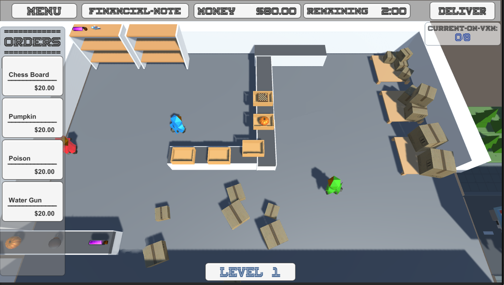
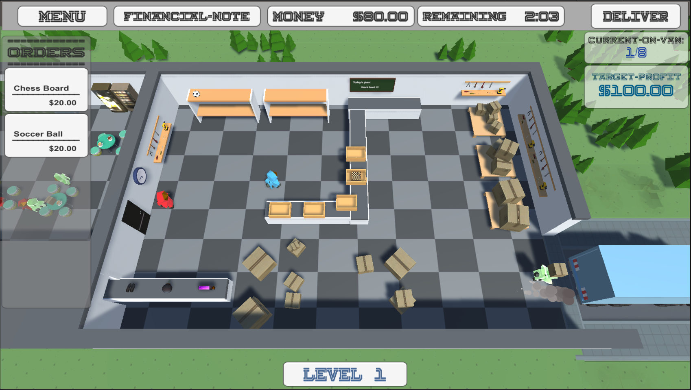

**The University of Melbourne - COMP30019 – Graphics and Interaction**

## Table of contents
* [Acknowledgment](#acknowledgment)
* [Explanation of the game](#explanation-of-the-game)
* [Technologies](#technologies)
* [In-Game Images](#in-game-images)
* [How to play](#how-to-play)
* [Objects and Entities](#object-and-entities)
* [Graphics Pipeline and Camera](#graphics-pipeline-and-camera)
* [Procedural Generation](#procedural-generation)
* [Shaders](#shaders)
* [Particle System](#particle-system)
* [Evaluations](#evaluations)
* [References](#references)
* [Team Contributions](#team-contributions)
* [Code Snipets ](#code-snippets)

## Acknowledgment

This game project was a school-based project developed by Hai Ha, Haiyao Yan, Jerry Zhou and Katherine Wu. The repository got the permission of all other team members before being copied and published (since the original repo belongs to The University of Melbourne and is private). 

I would like to express my special thanks to my teammates (Haiyao, Jerry and Katherine) who contributed to developing this project and gave me valuable team experience throughout the semester. 

**Link to the game trailer made by Katherine Wu:**
https://www.youtube.com/watch?v=GZtJLqMDruY

## Explanation of the game
Factorama is a simulation and strategy genre title that was inspired by the operation model of Amazon Fulfillment Center. The objective of the game is to make a target profit while managing the expenses during the operation process. Playing the role of manager, you are challenged to handle multiple stages of the packing process, keep track of the time and orders, and learn how to prioritise actions. Manage the factory your way and achieve more than just the profit. 

	
## Technologies
Project is created with:
* Unity 2021.1.13f1
* Ipsum version: 2.33
* Ament library version: 999

## In-Game Images

Our initial version:

  

Our current version (after gathering feedback from testers)

  

## How to play
**The process of gameplay comprises three basic tasks:**
  1. Choose an item when it arrives on the receiving conveyor belt. The receiving worker will move and move the item to storage.
  2. When an order shows up on the order bar, your next job is to select the correct item that is ordered. The picking worker will then move this item to the ready-to-pack conveyor belt   and transport it to the packing area.
  3. The final task is to select the item that is ready to be packed. The packing worker will pack the item and move it to the van station for delivery.

**During the gameplay:**
  - The van can be delivered whenever you want with a fuel cost of $30 each time, so be careful on making the right time to deliver.
  - From level 3, a debuff event is added where your workers get tired after an amount of working time. Their speed and efficiency are affected. Pay them to wake them up.

## Objects and Entities
The art style of the game is inspired by Overcooked, which emphasizes the features of objects by shape and color. This helps players distinguish between different objects and understand their roles. For example, the shelf is designed by taking common features of shelves from real life, like layers and supports and using different colors to emphasize the shelf structure. Minimal details were added to objects to ensure users won’t be distracted by visual effects but still be able to distinguish objects.

## Graphics Pipeline and Camera
Our handling of the graphics pipeline involves us feeding our game code into the Input-Assembler Stage. We also wrote custom Illumination and Dissolve shaders which converts the location of pixels to world space in the Vertex Shader Stage, and then applies color and effects in the Pixel Shader stage. 

For the camera positioning, we were going for a simulation/strategy game so the camera is fixed at a single overhead position for the whole game so that the player can observe and interact with the whole factory. We pulled the camera back a bit so that the player could not only see the whole factory floor, but also some of the surrounding roads, nature, and a connected breakroom. This was to provide additional aesthetics to the game scene via the presence of roads, nature, and a breakroom.

## Procedural Generation
Since our game is set to take place in a fulfillment centre, we want to make the room look like an actual warehouse where workers can organize items. Hence, we decided to add some cardboard boxes to the room to simulate the stock in the warehouse and improve aesthetics via procedural generation. 

Firstly, to avoid the random generated boxes overlapping with other settings in the room, the area for generation is limited to certain parts of the room. Then to show that items are divided into groups, we use perlin noise to create natural clusters. Since the room area isn’t big, the perlin noise was re-scale to fit room size. Random offset values are introduced to scroll the perlin noise up and down which ensures a new arrangement of boxes will be generated when the scene is loaded. After inputting  x and y coordinates into the perlin noise function, the box will only be generated if the return value exceeds the threshold. Another threshold with greater value was also introduced to add another box on top of the generated box to enhance the cluster feel. The value of thresholds are determined by several trial tests and we hard-coded the values that we think fit the game environment. Additionally, random rotation and scale had also applied to make the arrangement more natural. 

## Shaders
**Illuminate Shader (Assets\Materials\Shaders\Illuminate.shader):**
When the player clicks on the item, workers start walking toward their destinations. The illuminate shader provides the workers with an illuminate effect when they are triggered. In order to bring out this effect, we adopt the vert/frag shader structure

To create the generic lighting effects (diffuse, ambient), we need to pass the world normal in the vertex shader. The dot product (tells us about the angle between the light and the surface) of the world normal and light normal are used in conjunction to create a diffuse lighting effect. This means the more visible the shader on workers the stronger the light (higher value of the dot product).

The final color is the combination of the lighting effects (diffuse, ambient) and the rim color. We give rim power property a particular value for an appropriate strength of fade (with the rim color we set initially) on edges that creates an illuminating effect for workers.

**Dissolve Shader (Assets\Materials\Shaders\dissolve.shader):**
The dissolve shader is responsible for giving baskets on the conveyor belt a nice dissolving effect before they are destroyed. This is achieved by using a vert/frag shader structure. We then apply some standard diffuse and ambient lighting effects to the color of the pixels. Shadows are also added to provide a depth effect to the basket. Then the pixel colors are turned red based on a grayscale noise texture just before they are deleted.

For the generic lighting effects (diffuse, ambient) we do the same as the illuminate shader where we pass the world normal in the vertex shader. The dot product of the world normal and light normal are used in conjunction to create a diffuse lighting effect. 

To create the dissolve effect, we sample a grayscale noise texture. Darker pixels on the texture have a lower noise value and the lighter pixels have higher values. We set a threshold equal to time elapsed multiplied by the dissolve speed. The noise value of a pixel is less than the threshold, we delete the pixel. To make the dissolve effect run when we need it to, we pass the amount of time that the game as elapsed from the C# script to the shader to cancel out the _Time.y value and reset the time value to 0.

To add color to the dissolve effect, we create a second threshold that increases faster than the first dissolve effect threshold. When the noise value of the pixel becomes lower than this color threshold, we change the pixel color to the color we have predefined.

## Particle System
One of the particle systems that we implemented is the sleepy effect when the workers get tired. This particle system is activated when the debuff event is triggered and de-activated when the player pays their workers’ wages.

This particle system is looped when active, the initial lifetime and speed for particles are 1 and 2.5 respectively, which create a slow and tiring feeling.

Due to the large scale of the image source used for particles, the start size is re-scaled to 0.5. The simulation space is set to be local, which makes the particles follow the workers when they move. The emitter cone shape is chosen and particles are emitted from its base. The angle of emission is 45° and the arc is set to be 360°. These together widen the scattering area of the particles. The particle image source is a ‘Z’ character so it is easier to visualize on the screen when the render mode is a horizontal billboard.

This particle effect is located as a child component of every worker on the main gameplay scene. 

## Evaluations
For our evaluation, we sampled 5 participants from the 18-25 age range with a balanced gender ratio to test our game. We believed this to be a suitable demographic because the simulation concepts and sophistication of our game are targeted at a late-teen, young adult audience. Therefore our participants would provide us with relevant feedback which is based on characteristics of our target audience. We asked our participants to do their best to progress through the levels of our game.

The observational method we used was a Post-Task Walkthrough. We let our participants play out the levels without any interference or contributions from us. After having our participants study the tutorial screenshot for a basic understanding of the controls and the aim of the game, we let the participants play while we took notes in the background. The key idea behind this was to gain insight into whether our game controls, mechanics, and goal were intuitive and easy to grasp. With how many controls and nuances we had in our strategy/simulation game, we thought it was imperative that all the controls were easy to understand and the player was aware of what was required of them and what tools were at their disposal to achieve the goal. Data was collected by an observer. Key behavioural points were noted down during the playthrough, and then the participants were queried on their thought process after the playthrough.

The querying technique we used was to use the standardised questionnaire from Arun, Jonas and Joseph’s “Evaluating user performance in 3D stereo and motion enabled video games” report published in May 2012. The aim of this questionnaire was to gather more generalised feedback about their engagement with the game so that we knew how participants enjoyed the game and atmosphere. We used a long response format questionnaire because we wanted to gain an in-depth understanding of our participants’ feelings towards our game. Data was recorded by collating our participant’s responses to the questionnaire.

The feedback we received from the Post-Task Walkthrough was that it was not obvious when the player was locked out of making any additional actions. They would spam click items in hopes of doing something, even though there were no workers available to do it. There were also aspects of our user interface that were not intuitive and participants were unaware that some buttons could be pressed such as the financial-note button and the deliver van button. Furthermore, it was sometimes not obvious how to progress in the game. Participants were unaware that they needed to run the van to deliver the packages and were unaware of the conditions to pass the level.

The feedback received from the Questionnaire was that participants felt very disconnected from the game and there was a lack of engagement and attachment with the game. This was due to the plain graphics and imagery, as well as the lack of a background story to provide a premise for the player’s goals. Participants felt that the game was too challenging and that it was impossible to proceed to the higher levels. With a total of 9 levels, participants were only able to make it to level 3 before they hit a wall with progression.

**The changes we made based on the feedback from the Post-Task Walkthrough are as follows:**
  - To address the issue of aimless spam clicking, we added pop ups and notifications when the player tries to execute another action but no workers are available so that they know if they need to wait before another action can be taken.
  - To improve the clarity of our user interface, we added the levels target to the main UI screen so that it is clearer to the player what needs to be achieved to pass the level.
  - To make it more obvious what the player needs to do to progress, we added hints to the pop up notifications and alerts so that if the player is stuck we can direct them to what they need to do. E.g. Telling them to run the Van when it is full.

**The changes we made based on the feedback from the Questionnaire are as follows:**
  - To address the issue of the lack of engagement with the game, we tried to improve the graphics and imagery by taking inspiration from Overcooked’s backgrounds and added some decoration objects to the edge of the screen to create a more vibrant atmosphere. We also changed the texture of the floor and walls to add some more colors and make the game scene more exciting.
  - To address the issues with game difficulty, we revamped the characteristics of each level. We removed periodic debuff events and wage requirements from the lower levels. We also made some negative time events occur less frequently in the lower levels. These changes should allow players to progress to higher levels before feeling stuck and extremely challenged.

## References
**Highlighting System:**
https://blog.csdn.net/f_957995490/article/details/105058638?ops_request_misc=%257B%2522request%255Fid%2522%253A%2522163360849116780265433318%2522%252C%2522scm%2522%253A%252220140713.130102334..%2522%257D&request_id=163360849116780265433318&biz_id=0&utm_medium=distribute.pc_search_result.none-task-blog-2~all~sobaiduend~default-1-105058638.pc_search_es_clickV2&utm_term=unity+highlight+system&spm=1018.2226.3001.4187 - Adding highlighting effect to the items - Package used from the link above to generate the highlight effect. As the material for the soccer ball contains a height map, therefore, the illuminate shader could not be used in this case.

**Dissolve Shader:**
https://lindenreidblog.com/2017/12/16/dissolve-shader-in-unity/	- Tutorial on how to add a dissolve effect to the shader
https://www.youtube.com/watch?v=4XfXOEDzBx4&t=2113s&ab_channel=WorldofZero 	- Tutorial to help understand how to use vert/frag shaders
https://alastaira.wordpress.com/2014/12/30/adding-shadows-to-a-unity-vertexfragment-shader-in-7-easy-steps/		- Tutorial on how to provide shadows to the shader

**Audio controller (BMG volume manage):**
https://johnleonardfrench.com/the-right-way-to-make-a-volume-slider-in-unity-using-logarithmic-conversion/

## Team Contributions

| Name | Tasks |
| :---           | :---                                              |
| Hai Ha Nguyen  | Built the game’s user interface and created the controls that allowed the user to interact with it, implemented the Order Bar logic, level controller, debuff event, and particle systems for sleepy events and packing processes. |
| Haiyao Yan     | Coded the main logic of conveyor and shelf controller and built models for some objects, like conveyor, shelf and clock, implement particle system to create exhaust gas for the van. |
| Jerry Zhou     | Coded the initial basic ingame logic and controls for the workers and items, wrote the code for the Dissolve Shader and helped add the game scene decorations based on the feedback received during the evaluation stage. |
| Katherine Wu   | Wrote the code for the Illuminate Shader; added highlighting system for items; added background music and sound effects to the game.|

